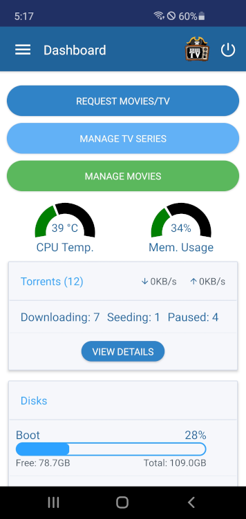
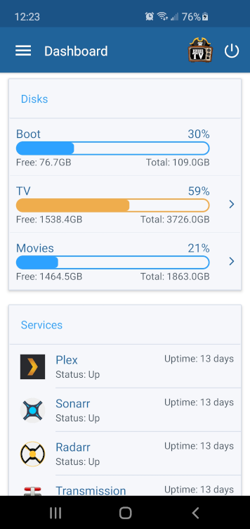
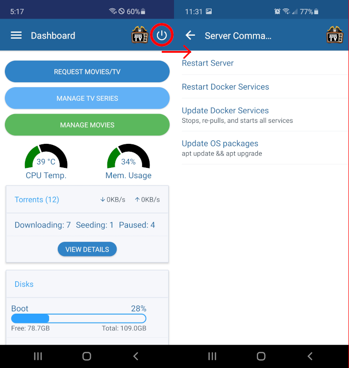
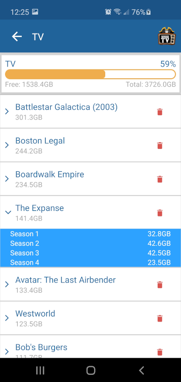
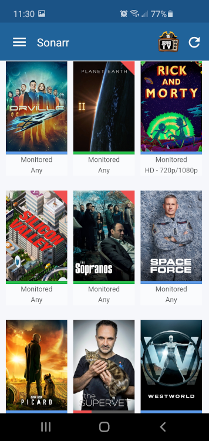
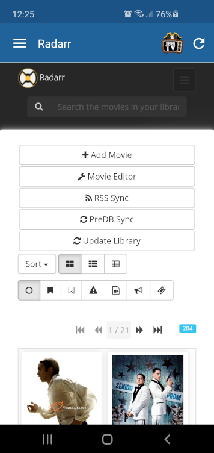
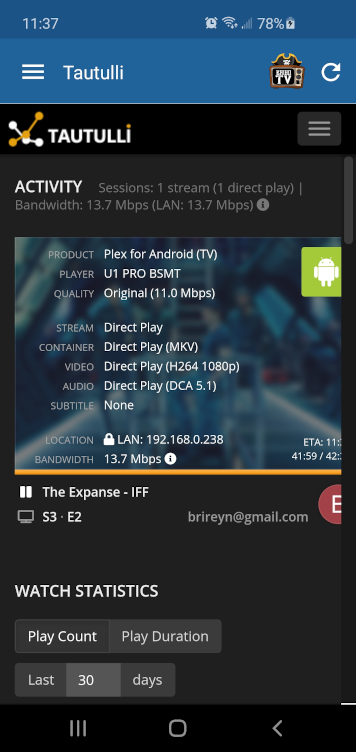

# BrianTV Mobile App

This is a React Native app that interfaces with a set of services related to running a Plex Media Server, such as the one found here: https://gitlab.com/bareynol/home-media-server

The app uses APIs provided by those services to display data about the server and provides quick access to frequent manual tasks. The app also provides webviews into those services for quick access.

## Supported Services 
The following services are currently supported

* [Plex Server](https://www.plex.tv/) - Media player system
* [Sonarr](https://sonarr.tv/) - TV Series management
* [Radarr](https://radarr.video/) - Movie management
* [Ombi](https://ombi.io/) - Easy requests for Sonarr/Radarr
* [Jackett](https://github.com/Jackett/Jackett)
* [Transmission](https://transmissionbt.com/) - Bitorrent client with web server
* [Tautulli](https://tautulli.com/) - Stats for Plex Media Server

## Supported Commands

* Quickly Delete TV Series / Movies
* Restart Server
* Restart Docker Services
* Update Docker Services
* Update OS packages

## Screens

### Dashboard

* Quick links to Ombi, Sonarr, and Radarr
* Server CPU Temperature and Memory Usage
* Downloads Summary
* Disks and Disk Usage
* Docker Services

### Server Commands

* Restart Server
* Restart Docker Services
* Update Docker services
* Update OS Packages

### Disk Breakdown

* TV Series / Movies sorted by size on disk
* Expanded TV Series show size of each season on disk
* Quick delete items (through sonarr / radarr API)

### Webviews

* Webviews attempt to auto-login to webviews of services when they can

